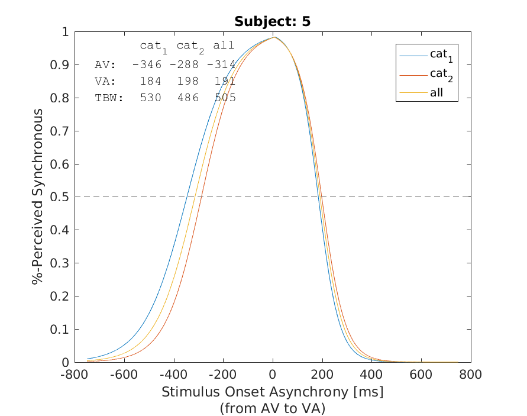
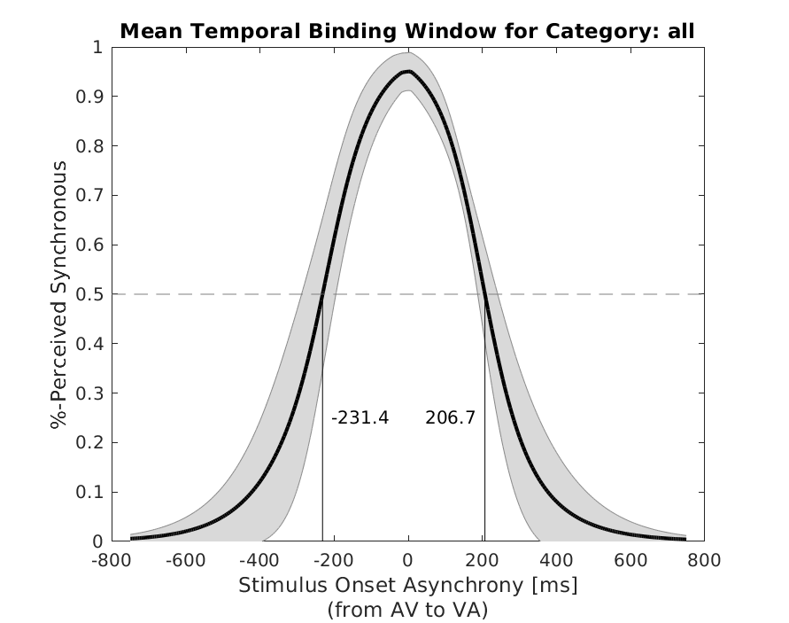
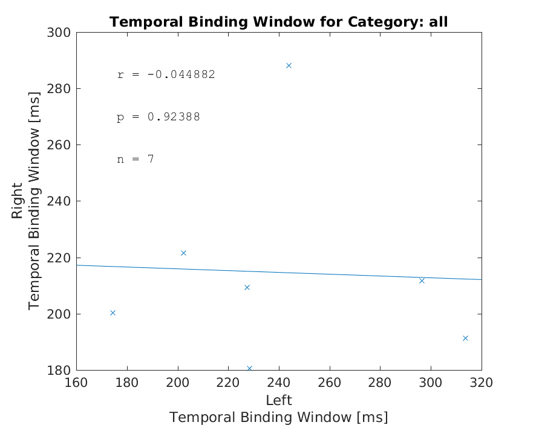

# Temporal Binding Window

These matlab scripts compute the temporal binding window (TBW) for a group of subject that participated in a behavioral multisensory integration study. The final output will look similar to Figure 2 in the paper [Stevenson et al. (2012). Individual differences in the multisensory temporal binding window predict susceptibility to audiovisual illusions](http://psycnet.apa.org/journals/xhp/38/6/1517/).

# Citation

If you use these scripts in your project, please cite it as: Notter, Michael P., & Murray, Micah M. (2017). Temporal Binding Window scripts: a lightweight matlab tool to analyse the temporal binding window in a multisensory integration study. *Zenodo* [http://doi.org/10.5281/zenodo.815876](http://doi.org/10.5281/zenodo.815876).

The script ``shadedErrorBar.m`` that creates the shaded error bar in the group figure was created by Rob Campbell and can be found here: [https://github.com/raacampbell/shadedErrorBar](https://github.com/raacampbell/shadedErrorBar)

# How does the script work?

To compute the mean TBW of the group you first need to run the script ``tbw_subj.m`` and then the ``tbw_group.m``.

The ``tbw_subj.m`` script expects as input an xlsx-file that contains the behavioral data of all subjects. Checkout the example dataset.xlsx to see how the data should be structured.

After running ``subj = tbw_subj('dataset.xlsx')``, you should have a result figure for each subject that shows you the subject individual TBW for all categories, as well as for each category individually:

Now, you are ready to run compute the mean TBW of the group. To do this, you need to run the command ``tbw_group(subj)``. This creates the final outputs:

 
